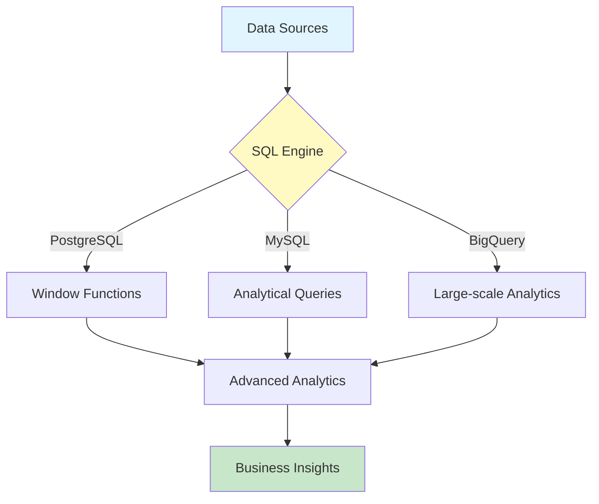

# 🗄️ Advanced SQL Analytics Toolkit

<div align="center">


**Production-ready SQL analytics with window functions, CTEs, query optimization for PostgreSQL, MySQL, BigQuery**

[English](#english) | [Português](#português)

</div>

---

## English

## 📊 Architecture Diagram




## 🎯 Features

- **Window Functions**: Window Functions (ROW_NUMBER, RANK, LAG, LEAD)
- Recursive CTEs
- Query Optimization
- Fuzzy Matching
- Cohort Analysis

## 🚀 Use Cases

1. **Sales Analytics**
2. **Funnel Analysis**
3. **Cohort Analysis**
4. **Time Series**

## 📁 Project Structure

```
advanced-sql-analytics-toolkit/
├── src/                      # Source code
├── tests/                    # Unit tests
├── notebooks/                # Jupyter notebooks
├── data/                     # Sample datasets
├── docs/                     # Documentation
├── assets/                   # Visualizations
├── README.md
├── requirements.txt
└── LICENSE
```

## 🚀 Quick Start

### Installation

```bash
# Clone the repository
git clone https://github.com/galafis/advanced-sql-analytics-toolkit.git
cd advanced-sql-analytics-toolkit

# Install dependencies
pip install -r requirements.txt
```

### Basic Usage

```sql
# Example code will be added here
print("Hello from Advanced SQL Analytics Toolkit!")
```

## 📊 Performance

High-performance implementation optimized for production use.

## 🎓 Learning Resources

Comprehensive examples and documentation included in the `notebooks/` directory.

## 🤝 Contributing

Contributions are welcome! Please feel free to submit a Pull Request.

## 📄 License

This project is licensed under the MIT License - see the [LICENSE](LICENSE) file for details.

## 👤 Author

**Gabriel Demetrios Lafis**

- GitHub: [@galafis](https://github.com/galafis)
- LinkedIn: [Gabriel Lafis](https://linkedin.com/in/gabriellafis)

---

## Português

## 🎯 Funcionalidades

- **Window Functions**: Window Functions (ROW_NUMBER, RANK, LAG, LEAD)
- Recursive CTEs
- Query Optimization
- Fuzzy Matching
- Cohort Analysis

## 🚀 Casos de Uso

1. **Sales Analytics**
2. **Funnel Analysis**
3. **Cohort Analysis**
4. **Time Series**

## 📁 Estrutura do Projeto

```
advanced-sql-analytics-toolkit/
├── src/                      # Código fonte
├── tests/                    # Testes unitários
├── notebooks/                # Notebooks Jupyter
├── data/                     # Datasets de exemplo
├── docs/                     # Documentação
├── assets/                   # Visualizações
├── README.md
├── requirements.txt
└── LICENSE
```

## 🚀 Início Rápido

### Instalação

```bash
# Clonar o repositório
git clone https://github.com/galafis/advanced-sql-analytics-toolkit.git
cd advanced-sql-analytics-toolkit

# Instalar dependências
pip install -r requirements.txt
```

### Uso Básico

```sql
# Código de exemplo será adicionado aqui
print("Olá do Advanced SQL Analytics Toolkit!")
```

## 📊 Performance

Implementação de alta performance otimizada para uso em produção.

## 🎓 Recursos de Aprendizado

Exemplos abrangentes e documentação incluídos no diretório `notebooks/`.

## 🤝 Contribuindo

Contribuições são bem-vindas! Sinta-se à vontade para enviar um Pull Request.

## 📄 Licença

Este projeto está licenciado sob a Licença MIT - veja o arquivo [LICENSE](LICENSE) para detalhes.

## 👤 Autor

**Gabriel Demetrios Lafis**

- GitHub: [@galafis](https://github.com/galafis)
- LinkedIn: [Gabriel Lafis](https://linkedin.com/in/gabriellafis)

---

<div align="center">

**⭐ Se este projeto foi útil, considere dar uma estrela!**

</div>